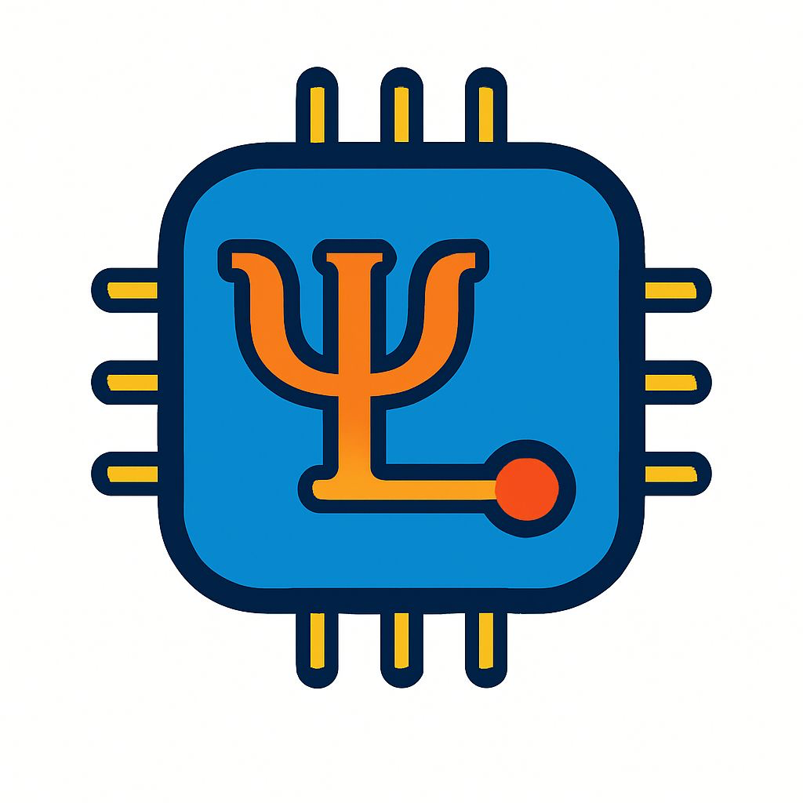

<div align="center">
  
  
  # Funky Junction
  ## Quantum Hardware Optimization Platform

  A comprehensive MCP server ecosystem for quantum circuit design using Qiskit Metal and electromagnetic simulation via Octave/OpenEMS.

  *Built by **Team Silicon Architects** at the Stanford MCP x Quantum Science Hackathon 2025*
  
  **Team Members:** Sarah Dweik, Sebastien Boussard, Paul Goldschmidt, & Gabriel Dupuis
</div>

## 🚀 Features

- **🔧 Quantum Circuit Design**: Complete design workflow with Qiskit Metal
- **⚡ EM Simulation**: Full-wave electromagnetic analysis using Octave/OpenEMS  
- **🔄 Optimization Loops**: Automated parameter optimization with convergence detection
- **📚 Learning Resources**: Python examples and research paper access
- **🤖 Dual MCP Architecture**: 25+ specialized tools across two integrated servers

## 🛠 Installation

### Prerequisites
- Python 3.8+, Octave 4.0+, OpenEMS, Git

### Quick Install
```bash
# Clone repository
git clone https://github.com/PaulGoldschmidt/qsim-mcp.git
cd qsim-mcp

# Install Python dependencies
pip install -r requirements.txt

# Install system dependencies (Ubuntu/Debian)
sudo apt update && sudo apt install octave openems

# Verify installation
python -c "import qiskit_metal; print('✓ Qiskit Metal ready')"
octave --version && openEMS --version
```

## 🚀 Quick Start

**Start Both MCP Servers:**
```bash
# Terminal 1 - Qiskit Metal Server
cd src/qiskit-metal-mcp && python quantum_hardware_mcp_server.py

# Terminal 2 - Octave OpenEMS Server  
cd src/octave-mcp && python octave_openems_server.py
```

**Basic Optimization Workflow:**
```python
# 1. Design Phase
create_design()
set_design_variables(cpw_width='10um', cpw_gap='6um')
create_transmons(q1_pos_x='-2.5mm', q2_pos_x='2.5mm')
export_design_to_gds('./quantum_design.gds')

# 2. Simulation Phase
create_cpw_octave_simulation(name='opt_v1', width=10.0, gap=6.0)
run_octave_simulation('opt_v1')

# 3. Analysis & Iteration
analyze_octave_impedance('opt_v1')
# Adjust parameters if needed and repeat

# 4. Export Results
export_octave_results('opt_v1', export_format='touchstone')
```

## 📁 Project Structure

```
qsim-mcp/
├── src/
│   ├── qiskit-metal-mcp/          # Quantum circuit design server
│   │   ├── quantum_hardware_mcp_server.py
│   │   └── requirements.txt
│   ├── octave-mcp/                # EM simulation server
│   │   ├── octave_openems_server.py
│   │   └── requirements.txt
│   └── resources/                 # Examples and papers
├── requirements.txt               # Combined dependencies
└── README.md
```

## 🔧 Available Tools

### Qiskit Metal Design Tools
- `create_design()` - Initialize quantum circuit design
- `set_design_variables()` - Configure CPW parameters (`cpw_width`, `cpw_gap`)
- `create_transmons()` - Add transmon qubits with positioning
- `add_coupler()` - Create spiral inductors (`n_turns`, `spacing`)
- `connect_components()` - Route CPW transmission lines
- `export_design_to_gds()` - Export for fabrication
- `visualize_gds_with_klayout()` - Professional visualization

### Octave/OpenEMS Simulation Tools
- `create_cpw_octave_simulation()` - Set up EM simulation
- `run_octave_simulation()` - Execute full-wave analysis
- `extract_octave_s_parameters()` - Analyze S11, S21 parameters
- `analyze_octave_impedance()` - Verify 50Ω characteristic impedance
- `export_octave_results()` - Export to Touchstone, CSV, JSON
- `list_octave_simulations()` - View completed simulations

## 🔄 Optimization Workflow

1. **Set Targets**: Define optimization goals (impedance, Q-factor, coupling)
2. **Design**: Create/modify quantum circuit components in Qiskit Metal
3. **Simulate**: Run electromagnetic analysis with synchronized parameters
4. **Analyze**: Compare results against targets  
5. **Iterate**: Adjust parameters until convergence
6. **Export**: Generate GDS files and simulation reports

## ⚙️ Configuration

**MCP Client Setup:**
```json
{
  "mcpServers": {
    "qiskit-metal": {
      "command": "python3",
      "args": ["src/qiskit-metal-mcp/quantum_hardware_mcp_server.py"]
    },
    "octave-openems": {
      "command": "python3", 
      "args": ["src/octave-mcp/octave_openems_server.py"]
    }
  }
}
```

## 🔧 Troubleshooting

**System Requirements Issues:**
```bash
# Install missing dependencies
sudo apt install octave openems  # Ubuntu/Debian
brew install octave              # macOS

# Check installations
check_octave_openems_status()
check_status()
```

**Common Solutions:**
- **Simulation timeout**: Increase timeout in `config.json` 
- **Memory issues**: Use `clear_octave_data("all")`
- **Permission errors**: Check file paths and write permissions

## 💡 Example: Complete Optimization

```python
# Target: 50Ω ±5% characteristic impedance
targets = {'impedance': 50.0, 'tolerance': 2.5}

for iteration in range(1, 6):
    # Design with current parameters
    set_design_variables(cpw_width=f'{current_width}um', cpw_gap=f'{current_gap}um')
    
    # Simulate
    create_cpw_octave_simulation(name=f'iter_{iteration}', 
                                width=current_width, gap=current_gap)
    run_octave_simulation(f'iter_{iteration}')
    
    # Analyze and check convergence
    results = analyze_octave_impedance(f'iter_{iteration}')
    if within_tolerance(results, targets):
        print(f"✅ Converged in {iteration} iterations!")
        break
    
    # Adjust parameters for next iteration
    current_width, current_gap = optimize_parameters(results, targets)

# Export final design
export_design_to_gds('./optimized_quantum_chip.gds')
export_octave_results(f'iter_{iteration}', 'touchstone')
```

---

## 📄 License
MIT License - see LICENSE file for details.

## 🤝 Contributing  
Contributions welcome! Create an issue or submit a pull request.

*Built with ❤️ by Team Silicon Architects for the quantum computing community*
